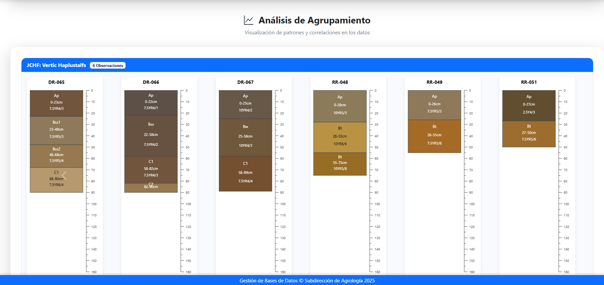

  

<h1 align="center">👨‍💻 Hoja de Vida – Carlos Eduardo Gómez Rico</h1>

  <a href="HV_CarlosEduardoGomezRico_2025.pdf"><b>Ver hoja de vida en PDF</b></a> •
  <a href="https://www.linkedin.com/in/carlos-eduardo-gómez-rico-842084128"><b>LinkedIn</b></a>

  📍 Bogotá, Colombia &nbsp;|&nbsp; 📧 ing.carlosgomez0219@gmail.com

---

## 🧩 Perfil Profesional

Soy Ingeniero Industrial con estudios de posgrado en Desarrollo de Software y más de 10 años de experiencia liderando proyectos en GIS, automatización de procesos, análisis espacial y desarrollo de soluciones tecnológicas para entidades del sector público y privado.

Mi enfoque combina la ingeniería con la programación, la visualización de datos y la geografía, permitiendo el desarrollo de herramientas robustas, sostenibles y adaptables a diferentes entornos tecnológicos.

---

## 💡 Tecnologías y herramientas

- **Bases de datos**: PostgreSQL, MySQL, SQL Server, SQLite  
- **Lenguajes**: Python, JavaScript, SQL, HTML, CSS, VBA  
- **GIS**: ArcGIS Pro, QGIS, gvSIG  
- **Frameworks y entornos**: MVC, MMVC, Flutter, Android Studio  
- **BI y análisis**: Power BI, pandas, Leaflet, Mapbox  
- **Automatización**: Excel VBA, procesamiento espacial, visores, formularios móviles

---

## 🗺️ Representación espacial de datos de campo

  

La imagen anterior ilustra la representación espacial de datos recolectados en campo, utilizando herramientas de Sistemas de Información Geográfica (SIG) para el análisis y visualización geográfica avanzada.

---

## 🌱 Representación gráfica de los horizontes de suelos

  

  

Gráfico generado mediante secuencias en JavaScript, empleando librerías de la suite AQP y Soil Taxonomy, que permite la homologación y visualización de los horizontes de suelos identificados en los estudios. Esta representación facilita la interpretación y comparación de perfiles edáficos conforme a estándares internacionales.

---

## 📊 Estadísticas y gráficos

  
  

---

## 📁 Archivos

- [HV_CarlosEduardoGomezRico_2025.pdf](HV_CarlosEduardoGomezRico_2025.pdf): Versión actualizada y completa de mi hoja de vida.

---

## ✉️ Contacto

¿Quieres trabajar conmigo o tienes una propuesta de colaboración?  
📩 Escríbeme a: **ing.carlosgomez0219@gmail.com**

---

  

